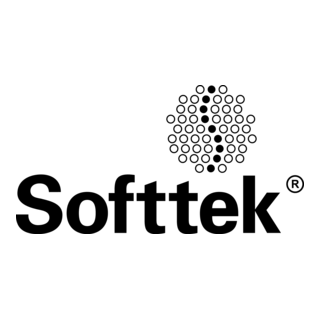

# José Antonio Escalante López

<div align="left">
  <a href="https://x.com/ds_jael" style="text-decoration:none; margin:5px;">
    
  </a>
  <a href="https://www.linkedin.com/in/jaelds/" style="text-decoration:none; margin:5px;">
    
  </a>
  <a href="https://github.com/JaelDS/JaelDS" style="text-decoration:none; margin:5px;">
    
  </a>
  <a href="https://www.hackerrank.com/profile/n22j14_je" style="text-decoration:none; margin:5px;">
    
  </a>
  <a href="mailto:jael_dev@proton.me" style="text-decoration:none; margin:5px;">
    
  </a>
  <a href="https://wa.me/+61466188939" style="text-decoration:none; margin:5px;">
    
  </a>
</div><br>
<br>

## 👨‍💻 About Me

Data Engineer and ETL Developer with 5+ years of experience specializing in database migration, CI/CD pipeline management, and big data solutions. Currently pursuing a Master's in Cybersecurity at Torrens University in Brisbane, Australia.

<details>
  <summary><b>🛠️ Tech Skills</b></summary>
  <br>
  
  - **Programming**: Python, SQL, Shell Scripting, Spark, Java, Javascript, HTML, CSS
  - **ETL Tools**: Informatica PowerCenter (IPC), Ab Initio, Datio
  - **Cloud & Big Data**: Google Cloud Platform (BigQuery, BigTable), Hadoop, HDFS, YARN
  - **Databases**: Oracle, Teradata, Hive
  - **Cybersecurity**: Kerberos, CyberArk, encryption, permissions management
  - **Project Management**: Agile, Scrum, Jira, CI/CD (Jenkins, Bitbucket)
  - **Tools**: VS Code, IntelliJ, GitHub, Adobe XD, Adobe Illustrator, Figma, Adobe Photoshop, Docker, Git
</details>

## 🎓 Education & Institutions

<div align="center">
  <table>
    <tr>
      <td align="center">
        <a href="https://www.torrens.edu.au/" target="_blank">
          
          <br />
          <b>Torrens University</b>
        </a>
      </td>
      <td align="center">
        <a href="https://www.unam.mx/" target="_blank">
          
          <br />
          <b>UNAM</b>
        </a>
      </td>
      <td align="center">
        <a href="https://www.ibm.com/" target="_blank">
          
          <br />
          <b>IBM</b>
        </a>
      </td>
      <td align="center">
        <a href="https://www.softtek.com/" target="_blank">
          
          <br />
          <b>Softtek</b>
        </a>
      </td>
    </tr>
  </table>
</div>

## 🚀 Professional Roles

- **L3 AMS Support Engineer** at Softtek - Citibanamex (Mexico City) | Jun 2023 - Aug 2024
- **Database Migration and Big Data Specialist** at Softtek - BBVA (Mexico City) | Sep 2022 - Jan 2023
- **ETL Developer and Big Data Analyst** at Softtek (Mexico City) | Jul 2022 - Jan 2023

## 🏆 Certifications

<a href="https://www.credly.com/badges/47e717f7-fd7e-400d-9f50-eba031f53618/linked_in?t=rn77jd"></a>
<a href="https://www.informatica.com/mx/products/cloud-integration.html"></a>

## 🎓 Education

- **Masters in Cybersecurity** - Torrens University (Brisbane, QLD) | Expected 2027
- **Scaled Agile Scrum Certification** - Mexico City | Nov 2022 - Dec 2022

## 💻 Developer Profile

```javascript
package Developer;

public class Jael {
    private String code = "Javascript, HTML, CSS, Python, Java, Markdown";
    private String tools ="VS Code, IntelliJ, GitHub, Adobe XD, Adobe Illustrator, 
                            Figma, Adobe Photoshop, Docker, Git";
    private String areas = "Web, UI/UX, Data Engineering, Cybersecurity, ETL";
    
    public String getCode(){  return code;  }
    public String getTools(){  return tools;  }
    public String getAreas(){  return areas;  }
    
    public boolean setCode(String code){
        if (!code.isEmpty()){
            this.code = "Keep learning!!!!!";
            return true;
        }else
            return "Keep improving!!!!!";
    }

    public boolean setTools(String tools){
        if (!tools.isEmpty()){
            this.tools = "Learn a new tool!!!!!";
            return true;
        }else
            return "Keep improving until master the tools!!!!!";
    }

    public boolean setAreas(String areas){
        if (!areas.isEmpty()){
            this.areas = "Keep looking for new areas!!!!!";
            return true;
        }else
            return "Keep improving until master the areas!!!!!";
    }

    public String showMessage(){
        return
                "challenge: I'm changing my career path and working hard to achieve my dreams!!!!!";
    }
}
```

## 📊 GitHub Activity

[](https://github.com/DenverCoder1/github-readme-streak-stats)

[](https://github.com/ashutosh00710/github-readme-activity-graph)


<div>
  
  
</div>

<div>
  
  
</div>

## 🔭 Current Projects

- 🔐 Exploring cybersecurity frameworks and threat modeling
- 🌐 Building a personal portfolio showcasing data engineering projects
- 📊 Developing data visualization tools for big data analysis

## 📫 Connect With Me

- 📱 Mobile: 0466 188 939
- 📞 WhatsApp: +525521028726 | +61466188939
- 📧 Email: [jael_dev@proton.me](mailto:jael_dev@proton.me)
- 🌐 Personal Hub: [https://jaelds.github.io/HUB/](https://jaelds.github.io/HUB/)

<div align="center">
  <a href="https://github.com/JaelDS">
    
  </a>
  <a href="#">
    
  </a>
  <a href="mailto:jael_dev@proton.me">
    
  </a>
</div>

<p align="center">
  
</p>

